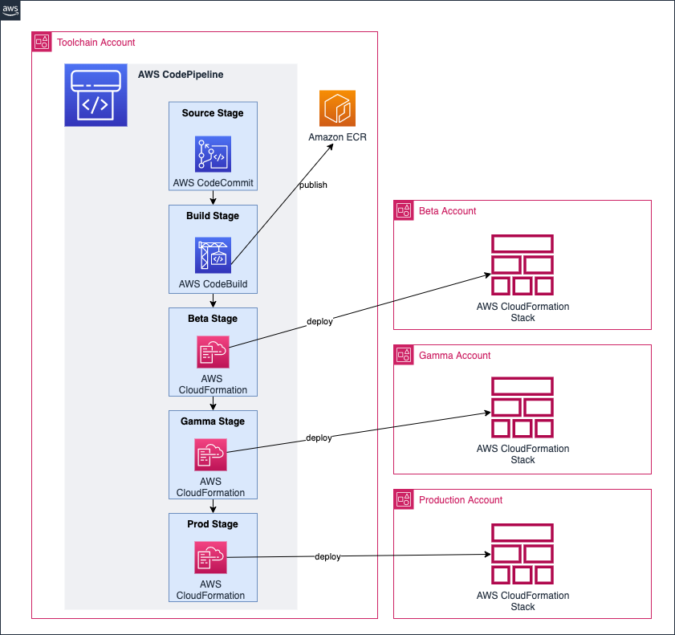

# Overview

Reference implementation of application pipeline from DPRA that includes a CI/CD pipeline to build an application and deploy via AWS CloudFormation across 3 different environment accounts.



The application is a Java [Spring Boot](https://spring.io/projects/spring-boot) API that runs as an Amazon ECS Service with an Amazon Aurora database.


This reference implementation contains the following significant components:

* [infrastructure/](infrastructure) - [Amazon CDK](https://aws.amazon.com/cdk/) code necessary to provision the pipeline (see [pipeline.ts](infrastructure/src/pipeline.ts)) and the application (see [deployment/index.js](infrastructure/src/deployment/index.ts)). This directory also contains [tests](infrastructure/test/) for the infrastructure code, including SAST (static application security testing) with [cdk-nag](https://github.com/cdklabs/cdk-nag).
* [src/](src) - Java source code for a simple API that manages a list of fruits in a relational database. Unit tests are available for the application in [src/test/java](src/test/java).

> **Warning**
> This reference implementation has intentionally not followed the following [AWS Well-Architected](https://aws.amazon.com/architecture/well-architected/) best practices to make it accessible by a wider range of customers. Be sure to address these before using this code for any workloads in your own environment:

* [ ] **cdk bootstrap with AdministratorAccess** - the default policy used for `cdk bootstrap` is `AdministratorAccess` but should be replaced with a more appropriate policy with least priviledge in your account.
* [ ] **TLS on HTTP endpoint** - the listener for the sample application uses HTTP instead of HTTPS to avoid having to create new ACM certificates and Route53 hosted zones. This should be replaced in your account with an `HTTPS` listener.

## Pipeline Setup

This reference implementation is intended to be used in your own accounts. By deploying the CDK application in your toolchain account, a new AWS CodeCommit repository will be created and will be seeded with this reference implementation. You'll need to perform the following steps:

1. Install prerequisite software: [Node.js](https://nodejs.org/en/)
2. Install dependencies: `npx yarn install`
3. Create 4 AWS Accounts: toolchain, beta, gamma, production
4. Bootstrap the accounts:

```bash
npm run bootstrap --exec
```

5. Deploy the pipeline to the toolchain account:

```bash
# Use the AWS Profile for your toolchain account
npx cdk deploy --all
```

8. (OPTIONAL) If you'd like to make changes and deploy with the pipeline, you'll need to [setup Git for AWS CodeCommit](https://docs.aws.amazon.com/codecommit/latest/userguide/setting-up.html) and then clone the new CodeCommit repository:

```bash
git clone https://git-codecommit.us-west-2.amazonaws.com/v1/repos/fruit-api
```

## Local Development

Setup [pre-commit](https://pre-commit.com/): `brew install pre-commit && pre-commit install`

To test changes to the CDK code, run:

```bash
npm test
```

To deploy the application directly to an AWS account outside a pipeline, run:

```bash
cdk deploy -c deployMode=local
```

To run the Java application locally, run:

```bash
mvn spring-boot:run
```
