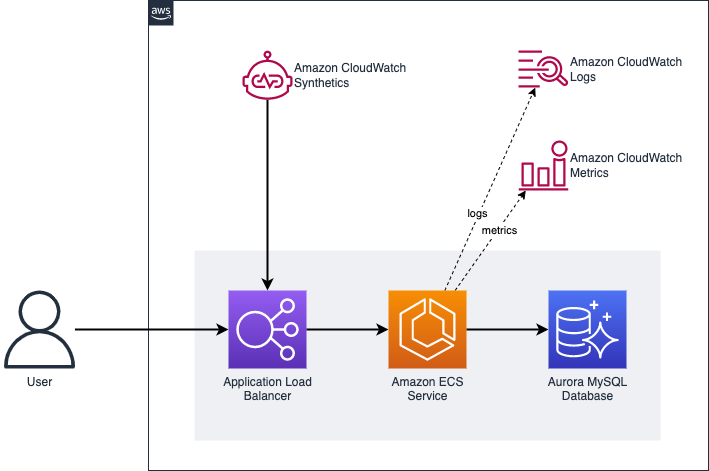

# Overview

Reference implementation of application pipeline from DPRA that includes a CI/CD pipeline to build an application and deploy via AWS CloudFormation across 3 different environment accounts.


The application is a Java [Spring Boot](https://spring.io/projects/spring-boot) API that runs as an Amazon ECS Service with an Amazon Aurora database.



This reference implementation contains the following significant components:

* [infrastructure/](infrastructure) - [Amazon CDK](https://aws.amazon.com/cdk/) code necessary to provision the pipeline (see [pipeline.ts](infrastructure/src/pipeline.ts)) and the application (see [deployment/index.js](infrastructure/src/deployment/index.ts)). This directory also contains [tests](infrastructure/test/) for the infrastructure code, including SAST (static application security testing) with [cdk-nag](https://github.com/cdklabs/cdk-nag).
* [src/](src) - Java source code for a simple API that manages a list of fruits in a relational database. Unit tests are available for the application in [src/test/java](src/test/java).

## Pipeline Setup

This reference implementation is intended to be used in your own accounts. By deploying the CDK application in your toolchain account, a new AWS CodeCommit repository will be created and will be seeded with this reference implementation. You'll need to perform the following steps:

1. Install prerequisite software: [Node.js](https://nodejs.org/en/)
2. Install dependencies: `npx yarn install`
3. Create 4 AWS Accounts: toolchain, beta, gamma, production
4. Create a new file [infrastructure/src/constants.ts](infrastructure/src/constants.ts) from [infrastructure/src/constants.example.ts](infrastructure/src/constants.example.ts) and update with your own AWS Account IDs:

```typescript
export const constants = {
  APP_NAME: 'fruit-api',
  TOOLCHAIN_ENV: { account: '00000000', region: 'us-west-2' },
  BETA_ENV: { account: '111111111', region: 'us-west-2' },
  GAMMA_ENV: { account: '222222222', region: 'us-west-2' },
  PROD_ENV: { account: '333333333', region: 'us-west-2' },
} as const;
```

5. Bootstrap the toolchain account:

```bash
# Use the AWS Profile for your toolchain account
npx cdk bootstrap aws://$TOOLCHAIN_ACCOUNT_ID/$AWS_REGION
```

6. Bootstrap the environment accounts:

```bash
# Use the AWS Profile for your beta account
npx cdk bootstrap --trust $TOOLCHAIN_ACCOUNT_ID aws://$BETA_ACCOUNT_ID/$AWS_REGION

# Use the AWS Profile for your gamma account
npx cdk bootstrap --trust $TOOLCHAIN_ACCOUNT_ID aws://$GAMMA_ACCOUNT_ID/$AWS_REGION

# Use the AWS Profile for your production account
npx cdk bootstrap --trust $TOOLCHAIN_ACCOUNT_ID aws://$PROD_ACCOUNT_ID/$AWS_REGION
```

7. Deploy the pipeline to the toolchain account:

```bash
# Use the AWS Profile for your toolchain account
npx cdk deploy
```

8. (OPTIONAL) If you'd like to make changes and deploy with the pipeline, you'll need to [setup Git for AWS CodeCommit](https://docs.aws.amazon.com/codecommit/latest/userguide/setting-up.html) and then clone the new CodeCommit repository:

```bash
git clone https://git-codecommit.us-west-2.amazonaws.com/v1/repos/fruit-api
```

## Local Development

To test changes to the CDK code, run:

```bash
npm test
```

To deploy the application directly to an AWS account outside a pipeline, run:

```bash
cdk deploy -c deployMode=local
```

To run the Java application locally, run:

```bash
mvn spring-boot:run
```
